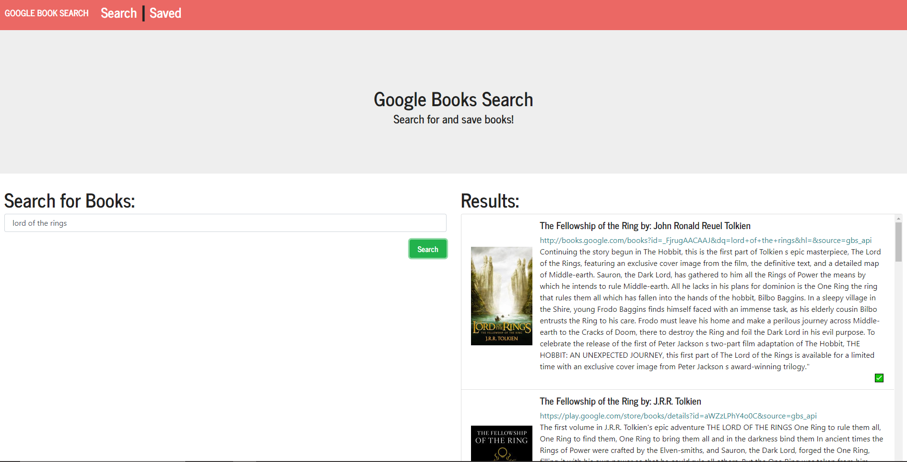
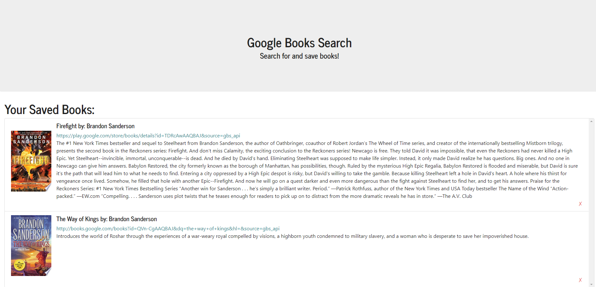

# Google Book Search
Garrett Reichman  
https://gsr-books-search.herokuapp.com/

## Description
  This app was made to practice creating a full stack MERN application. It uses the Google Books api to get book results based on user input, then allows the user to store those books in a mongo database to be viewed later.
## Usage
  To use this application, visit the link above. From there, you can either visit the search page or the saved page using the navbar at the top. On the search page, type in a search term into the input box then click then hit enter or click the button. The results will be displayed on the right side of the page. If you wish to save a book from this list, click the green check mark in the bottom right corner of the book object. 
  
  On the saved page, you will see a list of every book that has been saved to far. If you wish to remove a book, click the red x in the bottom right corner of the book object.
  
